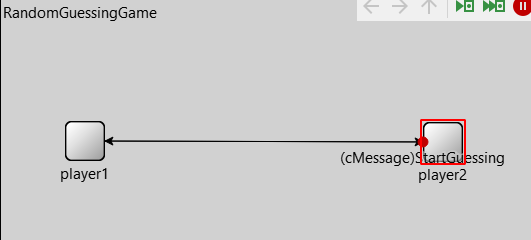

# Networks-Labs
## Lab1(Tic-Toc):
 - Tic starts the conversation with the word “Hello from tic”
 - Toc responds with “Hello from toc”
 - Tic responds with “Tic_1”
 - Toc responds with “Toc_2”  and so on 
 - The last message to be sent should be “Toc_8”.
 - After that, Tic will respond with message “Goodbye from tic” , And Toc will respond with message “Goodbye from toc”.Then the simulation terminates
 

## Lab2(Random Guessing Game):
- Player2 randomly chooses a guess and sends it to player1 .

- The guess ranges from 0 to 9 inclusive .

- If the guess is not correct, player1 sends to player2 a “wrong
guess” message .

- If the guess is correct, player1 sends a “correct guess” message
to player2 and the simulation is finished.

